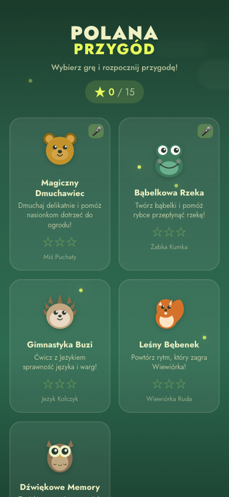
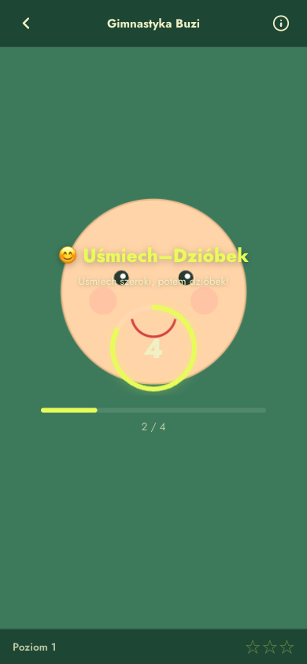
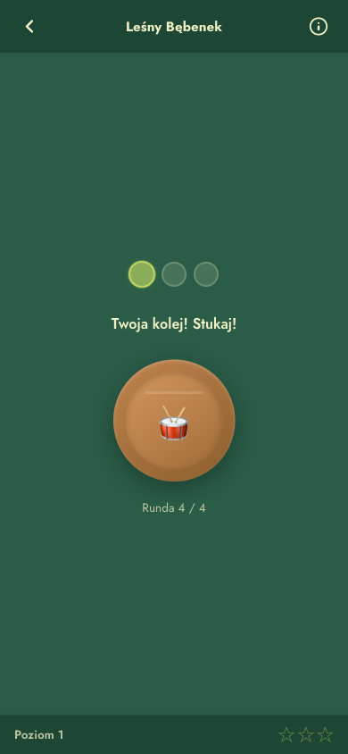
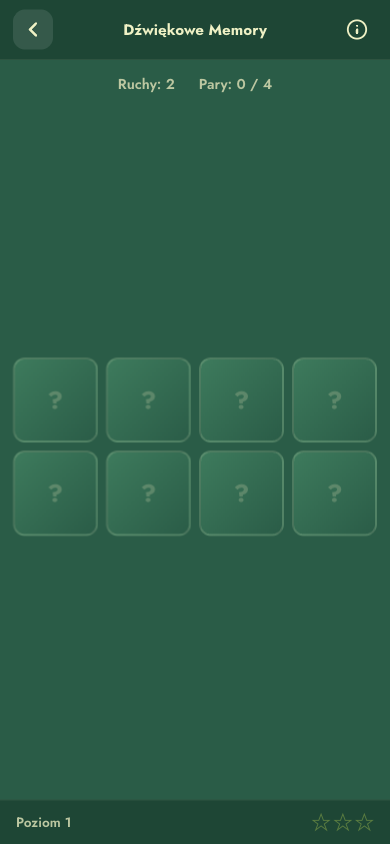

# POLANA PRZYGOD

### Logopedyczne Gry dla Dzieci

**5 interaktywnych mini-gier wspierajacych rozwoj mowy u dzieci**

Stworzone z :green_heart: dla [Polana Przygody](https://polanaprzygody.pl) — Centrum Rozwoju Dziecka, Wroclaw

---

[**:video_game: ZAGRAJ TERAZ**](https://polanaprzygody.github.io/polanka/)

---

<table>
<tr>
<td align="center"> <b>Menu glowne</b></td>
<td align="center"> <b>Gimnastyka Buzi</b></td>
</tr>
<tr>
<td align="center"> <b>Lesny Bebenek</b></td>
<td align="center"> <b>Dzwiekowe Memory</b></td>
</tr>
</table>

---

## O aplikacji

**Polana Przygod** to zestaw 5 mini-gier logopedycznych zaprojektowanych, aby w zabawny sposob wspomagac rozwoj mowy u dzieci. Kazda gra jest oparta na sprawdzonych metodach terapii logopedycznej i skupia sie na innym aspekcie rozwoju mowy.

Aplikacja dziala w pelni w przegladarce (HTML + JavaScript), nie wymaga serwera, instalacji ani logowania. Obsluguje telefony komorkowe i tablety.

## Mini-gry

| Gra | Opis | Cwiczenie logopedyczne | Mikrofon |
|-----|------|------------------------|----------|
| :bear: **Magiczny Dmuchawiec** | Dmuchaj w mikrofon, aby nasionka dmuchawca dolecially do ogrodu | Cwiczenia oddechowe — kontrola wydechu, wydluzanie fazy wydechowej | :microphone: Tak |
| :frog: **Babelkowa Rzeka** | Tworzenie babelek dmuchaniem, aby pomoc rybce przeplynal rzeke | Modulacja sily i dlugosci wydechu | :microphone: Tak |
| :hedgehog: **Gimnastyka Buzi** | Cwiczenia jezyka i warg z animowana twarza | Gimnastyka narzadow artykulacyjnych — ruchomosc, sila i precyzja jezyka i warg | |
| :chipmunk: **Lesny Bebenek** | Odtwarzanie wzorcow rytmicznych przez stukanie w beben | Poczucie rytmu i prozodia — koordynacja sluchowo-ruchowa | |
| :owl: **Dzwiekowe Memory** | Szukanie par zwierzat po ich charakterystycznych dzwiekach | Sluch fonematyczny — pamiec sluchowa, roznicowanie dzwiekow | |

## Dlaczego te cwiczenia sa wazne?

### Cwiczenia oddechowe
Prawidlowy oddech to **fundament mowy**. Kontrola strumienia powietrza wplywa na plynnosc mowy, jakosc glosu i zdolnosc do wypowiadania dluzszych zdan. Cwiczenia oddechowe przygotowuja do prawidlowej artykulacji glosek sybilantnych (s, z, sz, z, cz, dz).

### Gimnastyka narzadow artykulacyjnych
Jezyk, wargi i zuchwa to "narzedzia" potrzebne do mowienia. Niedostateczna ruchomosc jezyka jest jedna z **najczestszych przyczyn dyslalii**. Regularne cwiczenia zwiekszaja zakres ruchow, wzmacniaja miesnie i poprawiaja precyzje ustawiania narzadow mowy.

### Sluch fonematyczny
Zdolnosc rozrozniania fonemow (najmniejszych jednostek dzwiekowych mowy) jest kluczowa dla prawidlowej artykulacji i pozniejszej nauki czytania i pisania. Zaburzony sluch fonematyczny moze prowadzic do dysleksji i dysortografii.

### Poczucie rytmu i prozodia
Prozodia — "muzyka mowy" — obejmuje melodie, rytm i akcent wypowiedzi. **Logorytmika** (metoda laczaca muzyke, ruch i mowe) jest uznana metoda wspierajaca terapie logopedyczna, rozwijajaca plynnosc mowy i koordynacje sluchowo-ruchowa.

## Funkcje

- :iphone: **Responsywna** — dziala na telefonach, tabletach i komputerach
- :microphone: **Obsluga mikrofonu** — wykrywanie dmuchania przez Web Audio API
- :star: **System gwiazdek** — 3 poziomy trudnosci, sledzenie postepu
- :musical_note: **Dzwiek syntetyzowany** — efekty dzwiekowe generowane w przegladarce
- :floppy_disk: **Zapis postepow** — wyniki zapisywane w localStorage
- :globe_with_meridians: **Bez serwera** — dziala statycznie, zero zaleznosci
- :books: **Edukacyjne opisy** — szczegolowe wyjasnienia cwiczen i ich znaczenia

## Jak uzywac

1. [Otworz aplikacje](https://polanaprzygody.github.io/polanka/)
2. Wybierz gre z menu
3. Gry z ikona :microphone: wymagaja dostepu do mikrofonu
4. Usiadz z dzieckiem w spokojnym miejscu
5. Zachecaj do regularnych cwiczen (5–10 minut dziennie)

> **Uwaga:** Te gry sa uzupelnieniem, a nie zamiennikiem profesjonalnej terapii logopedycznej.

## Technologie

- HTML5 + Canvas API
- CSS3 (animacje, gradienty, flexbox/grid)
- JavaScript (vanilla, zero zaleznosci)
- Web Audio API (dzwiek, mikrofon)
- Google Fonts (Jost)

## Branding

Aplikacja korzysta z identyfikacji wizualnej [Polana Przygody](https://polanaprzygody.pl) — Centrum Rozwoju Dziecka we Wroclawiu. Paleta kolorow, typografia i styl graficzny sa zgodne z brandem.

---

**[Polana Przygody](https://polanaprzygody.pl)** — Centrum Rozwoju Dziecka

Profesjonalna logopedia i terapia integracji sensorycznej we Wroclawiu

---

[**:video_game: ZAGRAJ TERAZ**](https://polanaprzygody.github.io/polanka/)

